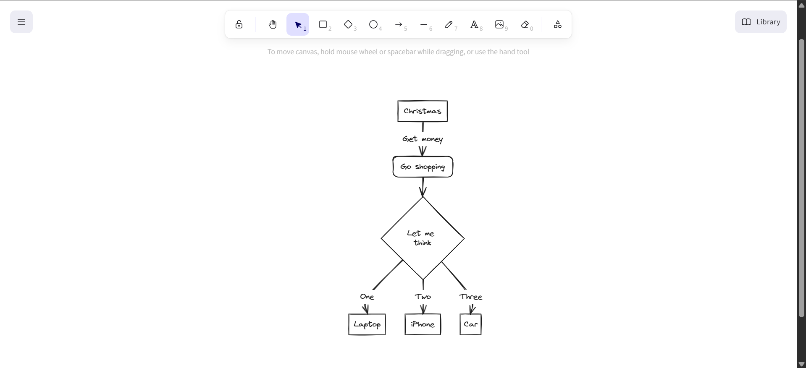

# Erasor

[](https://github.com/Saksham-Goel1107/Erasor/blob/main/LICENSE)
[](https://github.com/Saksham-Goel1107/Erasor/stargazers)
[](https://github.com/Saksham-Goel1107/Erasor/network)
[](https://github.com/Saksham-Goel1107/Erasor/issues)
[](https://github.com/Saksham-Goel1107/Erasor/pulls)
[](https://www.convex.dev/)
[](https://nextjs.org)
[](https://www.typescriptlang.org)
[](https://tailwindcss.com)

<div align="center">
  
  <h3>Your Ultimate Collaborative Workspace</h3>
  <p>Whiteboards + Document Editor + Team Collaboration in One Powerful App</p>
</div>

## 📑 Table of Contents

- [Features](#-features)
- [Demo](#-demo)
- [Technologies](#-technologies)
- [Installation](#-installation)
- [Usage](#-usage)
- [Contributing](#-contributing)
- [Support](#-support)
- [License](#-license)
- [Author](#-author)

## ✨ Features

🔹 **Real-time Collaboration**
- Work together with your team in real-time, seeing changes as they happen without delay or conflicts.

🔹 **AI-Powered Diagrams**
- Transform text descriptions into professional diagrams with our cutting-edge AI technology.

🔹 **Markdown Support**
- Write in Markdown and see your formatted document in real-time with our split-screen editor.

🔹 **Interactive Whiteboard**
- Create diagrams, flowcharts, and sketches with our interactive whiteboard powered by Excalidraw.

🔹 **Rich Text Editor**
- Write documents with a feature-rich editor powered by EditorJS, supporting headers, lists, checklists, and more.

🔹 **Team Management**
- Create and manage teams for better organization and collaboration.

🔹 **Secure Authentication**
- Secure user authentication powered by Kinde Auth.

🔹 **File Organization**
- Organize your documents and whiteboards in a clean, intuitive interface.

## 🎮 Demo



## 🛠 Technologies

Erasor is built with the following cutting-edge technologies:

- **Frontend**:
  - [Next.js 14](https://nextjs.org/) - React framework
  - [TypeScript](https://www.typescriptlang.org/) - Type-safe JavaScript
  - [Tailwind CSS](https://tailwindcss.com/) - Utility-first CSS framework
  - [Excalidraw](https://excalidraw.com/) - Whiteboard component
  - [EditorJS](https://editorjs.io/) - Block-style editor

- **Backend & State Management**:
  - [Convex](https://www.convex.dev/) - Backend database and real-time sync
  
- **Authentication**:
  - [Kinde Auth](https://kinde.com/) - Secure authentication provider

- **UI Components**:
  - [Radix UI](https://www.radix-ui.com/) - Accessible UI components
  - [Lucide React](https://lucide.dev/) - Beautiful SVG icons
  - [Sonner](https://sonner.emilkowal.ski/) - Toast notifications

## 📦 Installation

Follow these steps to set up the project locally:

1. **Clone the repository**:
   ```bash
   git clone https://github.com/Saksham-Goel1107/Erasor.git
   cd Erasor
   ```

2. **Install dependencies**:
   ```bash
   npm install
   # or
   yarn install
   ```

3. **Set up environment variables**:
   Create a `.env.local` file in the root directory and add:
   ```
   # Kinde Auth
   KINDE_CLIENT_ID=your_kinde_client_id
   KINDE_CLIENT_SECRET=your_kinde_client_secret
   KINDE_ISSUER_URL=your_kinde_issuer_url
   
   # Convex
   CONVEX_DEPLOYMENT=your_convex_deployment_url
   ```

4. **Run development server**:
   ```bash
   npm run dev
   # or
   yarn dev
   ```

5. **In a separate terminal, start Convex**:
   ```bash
   npx convex dev
   ```

6. Open [http://localhost:3000](http://localhost:3000) with your browser to see the result.

## 🚀 Usage

### Creating a Document/Whiteboard

1. Log in to your Erasor account
2. Navigate to the Dashboard
3. Click on "Create New" button
4. Select document or whiteboard type
5. Start editing!

### Team Collaboration

1. Create a team via the Teams section
2. Invite members through email
3. Share documents with the team
4. Collaborate in real-time

## 👥 Contributing

Contributions are what make the open-source community such an amazing place to learn, inspire, and create. Any contributions you make are **greatly appreciated**.

1. Fork the Project
2. Create your Feature Branch (`git checkout -b feature/AmazingFeature`)
3. Commit your Changes (`git commit -m 'Add some AmazingFeature'`)
4. Push to the Branch (`git push origin feature/AmazingFeature`)
5. Open a Pull Request

## 🤝 Support

Give a ⭐️ if this project helped you!

## 📝 License

This project is [MIT](LICENSE) licensed.

## 👤 Author

**Saksham Goel**

- GitHub: [@Saksham-Goel1107](https://github.com/Saksham-Goel1107)

---

<div align="center">
  Made with ❤️ by Saksham Goel
</div>
